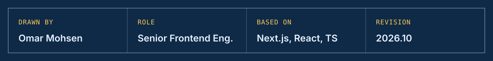

<picture>
  <source media="(max-width: 640px)" srcset="./assets/header-mobile.svg"/>
  
</picture>

  
  
  
  

### About

Senior frontend engineer working in Next.js, React and TypeScript.
I own features end to end: the architecture, the component model, the trade-offs, and the review that gets them to production.
My focus now is the layers behind the UI (APIs, data and system design), so frontend decisions are made with the whole system in view.

### Selected work

**In-browser file scanning — Next.js**
Spreadsheet and CSV import plus camera-based QR and barcode scanning, with no server round-trip.
Chose libraries by verified maintenance history, not popularity.
`Result: [add the outcome — e.g. time saved per import, error rate, users served]`

**Design system — design to production**
Built a shared component system with an AI-assisted pipeline from design to typed, reusable components.
`Result: [add the outcome — e.g. components shipped, teams adopting it, UI build time cut]`

<!-- Add one or two more here. Format: what it is → the decision you owned → the measurable result. -->

### How I lead the work

- **Decisions are written down.** Why this library, why this boundary, what we traded away.
- **Dependencies are a liability.** Nothing ships without a check on its real release and maintenance history.
- **AI drafts, engineers decide.** I use AI to move fast and keep architecture and review with humans.
- **Small, reviewable changes.** Strict types end to end, and mobile is part of "done".

### Stack

  

  
  
  
  

### Activity

  

### Open to

Senior and lead frontend roles, and full-stack work on product teams.
The fastest way to reach me is [email](mailto:omar33mohsen@gmail.com).

